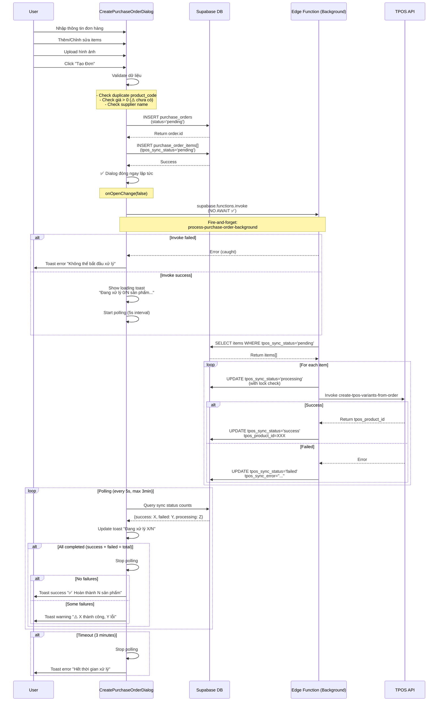
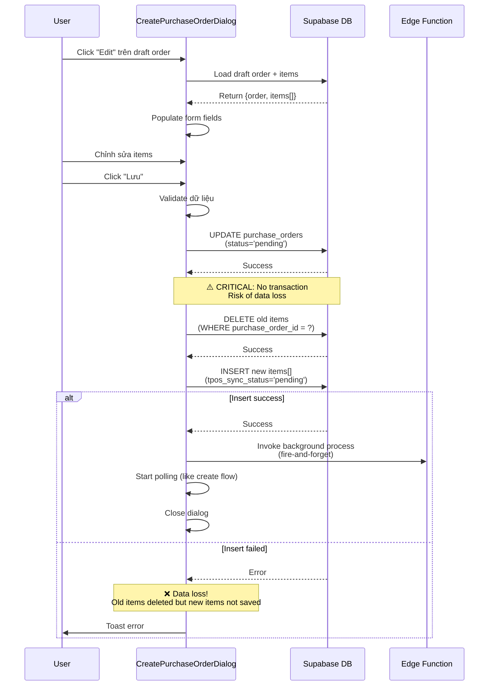

# Tài Liệu Kỹ Thuật: Hệ Thống Purchase Orders V1

**Version:** 1.0  
**Last Updated:** 2025-10-28  
**Status:** Production

---

## 📋 Mục Lục

1. [Tổng Quan Hệ Thống](#1-tổng-quan-hệ-thống)
2. [Kiến Trúc Database](#2-kiến-trúc-database)
3. [Flow Nghiệp Vụ Chi Tiết](#3-flow-nghiệp-vụ-chi-tiết)
4. [Hiện Thực Frontend](#4-hiện-thực-frontend)
5. [Hiện Thực Backend](#5-hiện-thực-backend)
6. [Biến Đầu Vào/Đầu Ra](#6-biến-đầu-vàođầu-ra)
7. [Rủi Ro & Điểm Cần Cải Thiện](#7-rủi-ro--điểm-cần-cải-thiện)
8. [Lịch Sử Thay Đổi](#8-lịch-sử-thay-đổi)
9. [Câu Hỏi Làm Rõ Nghiệp Vụ](#9-câu-hỏi-làm-rõ-nghiệp-vụ)
10. [Roadmap](#10-roadmap)
11. [Tài Liệu Tham Khảo](#11-tài-liệu-tham-khảo)

---

## 1. Tổng Quan Hệ Thống

### 1.1 Mục Đích

Hệ thống **Purchase Orders** quản lý toàn bộ quy trình đặt hàng từ nhà cung cấp, bao gồm:

- ✅ Tạo đơn đặt hàng với nhiều sản phẩm
- ✅ Tự động sinh biến thể sản phẩm (variants) dựa trên attributes
- ✅ Đồng bộ với TPOS (Tomato POS) thông qua Edge Functions
- ✅ Xử lý background không chặn UI
- ✅ Theo dõi trạng thái đồng bộ từng item real-time
- ✅ Upload hình ảnh sản phẩm và hóa đơn
- ✅ Quản lý draft orders (nháp)

### 1.2 Công Nghệ Sử Dụng

- **Frontend**: React 18.3 + TypeScript + Vite
- **State Management**: TanStack React Query v5.83
- **Backend**: Supabase Edge Functions (Deno runtime)
- **Database**: PostgreSQL (Supabase)
- **UI**: shadcn/ui + Tailwind CSS + Radix UI
- **External API**: TPOS OData API (Tomato POS)
- **Image Processing**: Base64 encoding cho TPOS upload

### 1.3 Kiến Trúc Tổng Quan

```
User → CreatePurchaseOrderDialog.tsx
  ↓
  1️⃣ Save to DB (purchase_orders + purchase_order_items)
     - INSERT purchase_orders với status='pending' hoặc 'draft'
     - INSERT purchase_order_items với tpos_sync_status='pending'
  ↓
  2️⃣ Invoke Edge Function (fire-and-forget, NO AWAIT)
     - supabase.functions.invoke('process-purchase-order-background')
     - Dialog đóng ngay lập tức ✅
  ↓
  3️⃣ Polling Progress từ UI (5s interval, max 3 phút)
     - Query tpos_sync_status từ purchase_order_items
     - Update toast: "Đang xử lý X/N sản phẩm..."
  ↓
  4️⃣ Edge Function → TPOS API
     - process-purchase-order-background: Loop qua items
     - create-tpos-variants-from-order: Tạo product/variants trên TPOS
     - Update tpos_sync_status: pending → processing → success/failed
  ↓
  5️⃣ Completion
     - Success: Toast "✅ Đã xử lý thành công N sản phẩm"
     - Failed: Toast "❌ X lỗi / N sản phẩm"
```

### 1.4 Các Trang Liên Quan

| Page | Route | Component | Chức năng |
|------|-------|-----------|-----------|
| Danh sách đơn hàng | `/purchase-orders` | `PurchaseOrders.tsx` | Xem danh sách, filter, status badges |
| Dialog tạo/sửa | - | `CreatePurchaseOrderDialog.tsx` | Tạo mới, edit draft |
| Chi tiết đơn hàng | - | `PurchaseOrderDetailDialog.tsx` | Xem chi tiết, retry failed items |
| Variant Generator | - | `VariantGeneratorDialog.tsx` | Chọn attributes để sinh variants |

---

## 2. Kiến Trúc Database

### 2.1 Bảng `purchase_orders`

**Mục đích**: Lưu thông tin header của đơn đặt hàng

#### Schema

| Column | Type | Nullable | Default | Constraint | Description |
|--------|------|----------|---------|------------|-------------|
| `id` | `uuid` | No | `gen_random_uuid()` | PRIMARY KEY | ID đơn hàng |
| `supplier_name` | `text` | **Yes** ⚠️ | `NULL` | - | Tên nhà cung cấp |
| `supplier_id` | `uuid` | Yes | `NULL` | FK to `suppliers` (nếu có) | ID nhà cung cấp |
| `order_date` | `timestamptz` | No | `now()` | - | Ngày tạo đơn |
| `status` | `text` | No | `'pending'` | - | `pending` / `completed` / `draft` |
| `notes` | `text` | Yes | `NULL` | - | Ghi chú đơn hàng |
| `invoice_number` | `text` | Yes | `NULL` | - | Số hóa đơn |
| `invoice_date` | `date` | Yes | `NULL` | - | Ngày hóa đơn |
| `invoice_images` | `text[]` | Yes | `NULL` | - | Mảng URLs ảnh hóa đơn |
| `total_amount` | `numeric` | Yes | `0` | - | Tổng tiền (trước giảm giá) |
| `discount_amount` | `numeric` | Yes | `0` | - | Số tiền giảm giá |
| `shipping_fee` | `bigint` | Yes | `0` | - | Phí vận chuyển |
| `final_amount` | `numeric` | Yes | `0` | - | Thành tiền cuối cùng |
| `created_at` | `timestamptz` | No | `now()` | - | Thời gian tạo |
| `updated_at` | `timestamptz` | No | `now()` | - | Thời gian cập nhật |

#### Indexes

```sql
-- Primary key
CREATE INDEX ON purchase_orders (id);

-- Filter by status
CREATE INDEX ON purchase_orders (status);

-- Sort by date
CREATE INDEX ON purchase_orders (order_date DESC);
```

#### RLS Policies

```sql
-- Allow authenticated users full access
CREATE POLICY "authenticated_select" ON purchase_orders FOR SELECT TO authenticated USING (true);
CREATE POLICY "authenticated_insert" ON purchase_orders FOR INSERT TO authenticated WITH CHECK (true);
CREATE POLICY "authenticated_update" ON purchase_orders FOR UPDATE TO authenticated USING (true);
CREATE POLICY "authenticated_delete" ON purchase_orders FOR DELETE TO authenticated USING (true);
```

#### ⚠️ Vấn đề hiện tại

1. **`supplier_name` nullable**: Nên thay đổi thành `NOT NULL` với default value
2. **Không có validation constraint**: Giá trị `status` có thể tự do, nên dùng ENUM hoặc CHECK constraint

---

### 2.2 Bảng `purchase_order_items`

**Mục đích**: Lưu chi tiết từng sản phẩm trong đơn (DECOUPLED khỏi bảng `products`)

#### ⚠️ Quan Trọng: Decoupling Architecture

Từ **Version 1.0**, `purchase_order_items` **KHÔNG CÒN** foreign key đến `products.id`.

**Lý do**:
- Purchase order là snapshot tại thời điểm đặt hàng
- Sản phẩm có thể thay đổi giá, tên, hoặc bị xóa sau khi đặt
- Cần giữ nguyên thông tin đơn hàng bất kể products table thay đổi

**Migration đã thực hiện**:
```sql
-- Xóa FK constraint
ALTER TABLE purchase_order_items DROP CONSTRAINT IF EXISTS purchase_order_items_product_id_fkey;

-- Drop column product_id
ALTER TABLE purchase_order_items DROP COLUMN IF EXISTS product_id;

-- Rename snapshot columns → primary columns
ALTER TABLE purchase_order_items RENAME COLUMN product_code_snapshot TO product_code;
ALTER TABLE purchase_order_items RENAME COLUMN product_name_snapshot TO product_name;
-- ... và các fields khác
```

#### Schema

| Column | Type | Nullable | Default | Constraint | Description |
|--------|------|----------|---------|------------|-------------|
| `id` | `uuid` | No | `gen_random_uuid()` | PRIMARY KEY | ID item |
| `purchase_order_id` | `uuid` | No | - | FK to `purchase_orders.id` | ID đơn hàng |
| `position` | `integer` | No | `1` | - | Thứ tự hiển thị |
| **📦 Product Data (Snapshot)** | | | | | |
| `product_code` | `text` | No | - | - | Mã sản phẩm (VD: "A01") |
| `product_name` | `text` | No | - | - | Tên sản phẩm |
| `variant` | `text` | Yes | `NULL` | - | Biến thể text (VD: "Đỏ, L") |
| `purchase_price` | `numeric` | No | - | - | Giá mua (VND) |
| `selling_price` | `numeric` | No | - | - | Giá bán (VND) |
| `quantity` | `integer` | No | `1` | CHECK `> 0` | Số lượng đặt |
| `product_images` | `text[]` | Yes | `NULL` | - | Mảng URLs ảnh sản phẩm |
| `price_images` | `text[]` | Yes | `NULL` | - | Mảng URLs ảnh bảng giá |
| `notes` | `text` | Yes | `NULL` | - | Ghi chú cho item này |
| **🔄 TPOS Sync Tracking** | | | | | |
| `tpos_product_id` | `integer` | Yes | `NULL` | - | ID sản phẩm trên TPOS |
| `tpos_sync_status` | `text` | Yes | `'pending'` | - | `pending`/`processing`/`success`/`failed` |
| `tpos_sync_started_at` | `timestamptz` | Yes | `NULL` | - | Thời điểm bắt đầu sync |
| `tpos_sync_completed_at` | `timestamptz` | Yes | `NULL` | - | Thời điểm hoàn thành sync |
| `tpos_sync_error` | `text` | Yes | `NULL` | - | Message lỗi nếu `status=failed` |
| `tpos_deleted` | `boolean` | Yes | `false` | - | Đã xóa trên TPOS chưa |
| `tpos_deleted_at` | `timestamptz` | Yes | `NULL` | - | Thời điểm xóa trên TPOS |
| **🎨 Variant Generator** | | | | | |
| `selected_attribute_value_ids` | `uuid[]` | Yes | `NULL` | - | Array IDs của attribute values đã chọn |
| **⏰ Timestamps** | | | | | |
| `created_at` | `timestamptz` | No | `now()` | - | Thời gian tạo |

#### Sync Status Flow

```
pending → processing → success
                    ↘  failed
```

- **`pending`**: Chưa xử lý, chờ edge function
- **`processing`**: Đang được xử lý bởi edge function (LOCKED)
- **`success`**: Đã tạo thành công trên TPOS
- **`failed`**: Tạo thất bại, có error message

#### Indexes

```sql
-- Primary key
CREATE INDEX ON purchase_order_items (id);

-- FK to order
CREATE INDEX ON purchase_order_items (purchase_order_id);

-- Filter by sync status
CREATE INDEX ON purchase_order_items (tpos_sync_status);

-- Sort by position
CREATE INDEX ON purchase_order_items (position);
```

#### RLS Policies

```sql
-- Allow authenticated users full access
CREATE POLICY "authenticated_select" ON purchase_order_items FOR SELECT TO authenticated USING (true);
CREATE POLICY "authenticated_insert" ON purchase_order_items FOR INSERT TO authenticated WITH CHECK (true);
CREATE POLICY "authenticated_update" ON purchase_order_items FOR UPDATE TO authenticated USING (true);
CREATE POLICY "authenticated_delete" ON purchase_order_items FOR DELETE TO authenticated USING (true);
```

#### ⚠️ Vấn đề hiện tại

1. **`product_code` không UNIQUE**: Cho phép duplicate trong cùng 1 order → Cần validate ở UI
2. **Không có CHECK constraint cho prices**: Có thể insert `purchase_price = 0`
3. **`tpos_sync_status` không có ENUM**: Có thể insert giá trị tùy ý

---

### 2.3 Bảng `product_attributes` & `product_attribute_values`

**Mục đích**: Lưu thuộc tính (VD: Màu sắc, Size) và giá trị (VD: Đỏ, XL) để sinh biến thể tự động

#### 2.3.1 Bảng `product_attributes`

| Column | Type | Nullable | Default | Description |
|--------|------|----------|---------|-------------|
| `id` | `uuid` | No | `gen_random_uuid()` | PRIMARY KEY |
| `name` | `text` | No | - | Tên thuộc tính (VD: "Màu sắc", "Kích thước") |
| `display_order` | `integer` | Yes | `0` | Thứ tự hiển thị trong UI |
| `is_active` | `boolean` | No | `true` | Còn sử dụng không |
| `created_at` | `timestamptz` | No | `now()` | - |
| `updated_at` | `timestamptz` | No | `now()` | - |

#### 2.3.2 Bảng `product_attribute_values`

| Column | Type | Nullable | Default | Description |
|--------|------|----------|---------|-------------|
| `id` | `uuid` | No | `gen_random_uuid()` | PRIMARY KEY |
| `attribute_id` | `uuid` | No | - | FK to `product_attributes.id` |
| `value` | `text` | No | - | Giá trị (VD: "Đỏ", "XL") |
| `code` | `text` | Yes | - | Mã ngắn gọn (VD: "RED", "XL") |
| **🔗 TPOS Mapping** | | | | |
| `tpos_id` | `integer` | Yes | `NULL` | ID value trên TPOS |
| `tpos_attribute_id` | `integer` | Yes | `NULL` | ID attribute trên TPOS |
| `sequence` | `integer` | Yes | `0` | Thứ tự trong TPOS |
| `name_get` | `text` | Yes | - | Tên hiển thị trên TPOS |
| `price_extra` | `numeric` | Yes | `0` | Phụ phí (nếu có) |
| **📋 UI Display** | | | | |
| `display_order` | `integer` | Yes | `0` | Thứ tự hiển thị trong VariantGenerator |
| `is_active` | `boolean` | No | `true` | Còn sử dụng không |
| **⏰ Timestamps** | | | | |
| `created_at` | `timestamptz` | No | `now()` | - |
| `updated_at` | `timestamptz` | No | `now()` | - |

#### Ví dụ dữ liệu

**product_attributes**:
```
id: uuid-attr-1, name: "Màu sắc", display_order: 1
id: uuid-attr-2, name: "Kích thước", display_order: 2
```

**product_attribute_values**:
```
-- Màu sắc
id: uuid-val-1, attribute_id: uuid-attr-1, value: "Đỏ", code: "RED", tpos_id: 101
id: uuid-val-2, attribute_id: uuid-attr-1, value: "Xanh", code: "BLUE", tpos_id: 102

-- Kích thước
id: uuid-val-3, attribute_id: uuid-attr-2, value: "S", code: "S", tpos_id: 201
id: uuid-val-4, attribute_id: uuid-attr-2, value: "M", code: "M", tpos_id: 202
id: uuid-val-5, attribute_id: uuid-attr-2, value: "L", code: "L", tpos_id: 203
```

#### Cartesian Product (Tổ hợp)

Nếu chọn:
- Màu sắc: [Đỏ, Xanh]
- Kích thước: [S, M, L]

→ Sinh ra **6 variants**:
```
1. Đỏ, S
2. Đỏ, M
3. Đỏ, L
4. Xanh, S
5. Xanh, M
6. Xanh, L
```

---

### 2.4 Bảng `products` (Reference Only)

**Mục đích**: Kho sản phẩm chính (KHÔNG join trực tiếp với `purchase_order_items`)

#### Schema (Relevant fields)

| Column | Type | Nullable | Constraint | Description |
|--------|------|----------|------------|-------------|
| `id` | `uuid` | No | PRIMARY KEY | - |
| `product_code` | `text` | No | **UNIQUE** ✅ | Mã sản phẩm (enforced at DB level) |
| `product_name` | `text` | No | NOT NULL | Tên sản phẩm |
| `variant` | `text` | Yes | - | Text biến thể (VD: "Đỏ, L") |
| `base_product_code` | `text` | Yes | - | Mã sản phẩm gốc (nếu là variant con) |
| **🔗 TPOS Mapping** | | | | |
| `tpos_product_id` | `integer` | Yes | - | ID parent product trên TPOS |
| `productid_bienthe` | `integer` | Yes | - | ID variant con trên TPOS (nếu là child) |
| **💰 Pricing** | | | | |
| `selling_price` | `numeric` | No | DEFAULT 0 | Giá bán hiện tại |
| `purchase_price` | `numeric` | No | DEFAULT 0 | Giá mua hiện tại |
| **📦 Inventory** | | | | |
| `stock_quantity` | `integer` | No | DEFAULT 0 | Tồn kho (local) |
| `virtual_available` | `integer` | No | DEFAULT 0 | Tồn khả dụng (từ TPOS) |
| **📸 Media** | | | | |
| `product_images` | `text[]` | Yes | - | URLs ảnh |
| `price_images` | `text[]` | Yes | - | URLs ảnh bảng giá |
| `tpos_image_url` | `text` | Yes | - | URL ảnh sync từ TPOS |
| **🏷️ Metadata** | | | | |
| `supplier_name` | `text` | Yes | - | Nhà cung cấp |
| `barcode` | `text` | Yes | - | Mã vạch |
| `category` | `text` | Yes | - | Danh mục |
| `unit` | `text` | No | DEFAULT 'Cái' | Đơn vị tính |

#### Relationship với Purchase Orders

```
purchase_order_items.product_code
  ↓ (KHÔNG CÓ FK)
  🔎 Lookup reference only
  ↓
products.product_code
```

- Purchase order items **KHÔNG PHỤ THUỘC** vào products table
- Khi tạo variants trên TPOS, edge function sẽ **UPSERT** vào products table
- Products table dùng để:
  - Reference khi hiển thị autocomplete
  - Sync stock từ TPOS
  - Quản lý inventory

#### ⚠️ Constraints Quan Trọng

```sql
-- UNIQUE constraint on product_code
ALTER TABLE products ADD CONSTRAINT products_product_code_key UNIQUE (product_code);

-- Index for faster lookup
CREATE INDEX products_product_code_idx ON products (product_code);
```

---

## 3. Flow Nghiệp Vụ Chi Tiết

### 3.1 Flow Tạo Đơn Hàng (Create Order)

#### Sequence Diagram



#### Code Flow (CreatePurchaseOrderDialog.tsx)

**Step 1: Validation**
```typescript
// Kiểm tra supplier name
if (!supplierName.trim()) {
  sonnerToast.error("Vui lòng nhập tên nhà cung cấp");
  return;
}

// Kiểm tra có items không
const validItems = items.filter(i => i.product_name.trim());
if (validItems.length === 0) {
  sonnerToast.error("Vui lòng thêm ít nhất 1 sản phẩm");
  return;
}

// ⚠️ THIẾU: Validate duplicate product_code
// ⚠️ THIẾU: Validate giá > 0
// ⚠️ THIẾU: Validate selling_price >= purchase_price
```

**Step 2: Create Order Mutation**
```typescript
const createOrderMutation = useMutation({
  mutationFn: async () => {
    // Insert order
    const { data: order, error: orderError } = await supabase
      .from("purchase_orders")
      .insert({
        supplier_name: supplierName,
        order_date: orderDate.toISOString(),
        notes: notes,
        invoice_number: invoiceNumber,
        invoice_date: invoiceDate?.toISOString(),
        invoice_images: invoiceImages,
        status: "pending", // ✅ Pending status
        // total_amount, discount_amount, shipping_fee, final_amount
        // → Calculated from items (nếu cần)
      })
      .select()
      .single();

    if (orderError) throw orderError;

    // Insert items
    const itemsToInsert = validItems.map((item, index) => ({
      purchase_order_id: order.id,
      position: index + 1,
      product_code: item.product_code,
      product_name: item.product_name,
      variant: item.variant || null,
      purchase_price: Number(item.purchase_price),
      selling_price: Number(item.selling_price),
      quantity: item.quantity,
      product_images: item.product_images || [],
      price_images: item.price_images || [],
      notes: item.notes || null,
      selected_attribute_value_ids: item.selected_attribute_value_ids || [],
      tpos_sync_status: 'pending', // ✅ Initial status
    }));

    const { error: itemsError } = await supabase
      .from("purchase_order_items")
      .insert(itemsToInsert);

    if (itemsError) throw itemsError;

    return order;
  },
  onSuccess: async (order) => {
    // Step 3: Invoke background function (NO AWAIT)
    supabase.functions.invoke(
      'process-purchase-order-background',
      { body: { purchase_order_id: order.id } }
    ).catch(error => {
      console.error('Failed to invoke background process:', error);
      sonnerToast.error("Không thể bắt đầu xử lý. Vui lòng thử lại.");
    });

    // Step 4: Show loading toast
    const totalItems = validItems.length;
    const toastId = `tpos-processing-${order.id}`;
    sonnerToast.loading(
      `Đang xử lý 0/${totalItems} sản phẩm...`,
      { id: toastId, duration: Infinity }
    );

    // Step 5: Start polling
    pollTPOSProcessingProgress(order.id, totalItems, toastId);

    // Step 6: Close dialog immediately
    onOpenChange(false);
    queryClient.invalidateQueries({ queryKey: ['purchase-orders'] });
  },
  onError: (error) => {
    console.error('Failed to create order:', error);
    sonnerToast.error("Tạo đơn hàng thất bại. Vui lòng thử lại.");
  }
});
```

**Step 3: Polling Function**
```typescript
const pollTPOSProcessingProgress = (
  orderId: string,
  totalItems: number,
  toastId: string
) => {
  const POLL_INTERVAL = 5000; // 5 giây
  const MAX_DURATION = 180000; // 3 phút
  const startTime = Date.now();

  const pollInterval = setInterval(async () => {
    // Check timeout
    if (Date.now() - startTime > MAX_DURATION) {
      clearInterval(pollInterval);
      sonnerToast.error(
        "Hết thời gian xử lý. Vui lòng kiểm tra lại đơn hàng.",
        { id: toastId }
      );
      return;
    }

    // Query sync status
    const { data: items, error } = await supabase
      .from('purchase_order_items')
      .select('tpos_sync_status')
      .eq('purchase_order_id', orderId);

    if (error || !items) {
      console.error('Polling error:', error);
      return;
    }

    // Count statuses
    const successCount = items.filter(i => i.tpos_sync_status === 'success').length;
    const failedCount = items.filter(i => i.tpos_sync_status === 'failed').length;
    const processingCount = items.filter(i => i.tpos_sync_status === 'processing').length;
    const completedCount = successCount + failedCount;

    console.log(`Polling [${orderId}]: ${completedCount}/${totalItems} completed`);

    // Update toast
    if (completedCount < totalItems) {
      sonnerToast.loading(
        `Đang xử lý ${completedCount}/${totalItems} sản phẩm...`,
        { id: toastId, duration: Infinity }
      );
    } else {
      // ✅ Hoàn thành
      clearInterval(pollInterval);
      
      if (failedCount === 0) {
        sonnerToast.success(
          `✅ Đã xử lý thành công ${successCount} sản phẩm`,
          { id: toastId, duration: 5000 }
        );
      } else if (successCount === 0) {
        sonnerToast.error(
          `❌ Tất cả ${failedCount} sản phẩm đều lỗi`,
          { id: toastId, duration: 10000 }
        );
      } else {
        sonnerToast.warning(
          `⚠️ ${successCount} thành công, ${failedCount} lỗi`,
          { id: toastId, duration: 10000 }
        );
      }

      // Refresh list
      queryClient.invalidateQueries({ queryKey: ['purchase-orders'] });
    }
  }, POLL_INTERVAL);

  // ⚠️ CRITICAL: pollInterval KHÔNG được cleanup khi component unmount
  // → Memory leak nếu user đóng page trước khi hoàn thành
};
```

---

### 3.2 Flow Chỉnh Sửa Draft

#### Sequence Diagram



#### ⚠️ Vấn đề Nghiêm Trọng: Data Loss Risk

**Scenario**:
1. User edit draft order có 10 items
2. DELETE thành công → 10 items bị xóa
3. INSERT fail (network error, validation error, etc.)
4. → Draft order không còn items nào!

**Root Cause**: 
- Không có database transaction
- DELETE và INSERT là 2 operations riêng biệt

**Solution** (chưa implement):
```sql
-- Tạo stored function với transaction
CREATE OR REPLACE FUNCTION update_purchase_order_items(
  p_order_id UUID,
  p_items JSONB
) RETURNS void AS $$
BEGIN
  -- Delete old items
  DELETE FROM purchase_order_items 
  WHERE purchase_order_id = p_order_id;
  
  -- Insert new items
  INSERT INTO purchase_order_items (
    purchase_order_id,
    position,
    product_code,
    product_name,
    -- ... other fields
  )
  SELECT 
    p_order_id,
    (item->>'position')::integer,
    item->>'product_code',
    item->>'product_name',
    -- ... other fields
  FROM jsonb_array_elements(p_items) AS item;
  
  -- If any error occurs, rollback both DELETE and INSERT
EXCEPTION WHEN OTHERS THEN
  RAISE;
END;
$$ LANGUAGE plpgsql;
```

```typescript
// Call from UI
const { error } = await supabase.rpc('update_purchase_order_items', {
  p_order_id: orderId,
  p_items: JSON.stringify(items)
});
```

---

### 3.3 Flow Xử Lý Background (Edge Function)

#### File: `supabase/functions/process-purchase-order-background/index.ts`

#### Input

```typescript
{
  purchase_order_id: string // UUID
}
```

#### Logic Flow

```typescript
serve(async (req) => {
  // 1️⃣ CORS handling
  if (req.method === 'OPTIONS') {
    return new Response(null, { headers: corsHeaders });
  }

  try {
    // 2️⃣ Parse request body
    const { purchase_order_id } = await req.json();

    if (!purchase_order_id) {
      throw new Error('Missing purchase_order_id');
    }

    console.log(`🔄 Processing order: ${purchase_order_id}`);

    // 3️⃣ Validate order exists
    const { data: order, error: orderError } = await supabase
      .from('purchase_orders')
      .select('id, supplier_name')
      .eq('id', purchase_order_id)
      .single();

    if (orderError || !order) {
      throw new Error(`Order not found: ${purchase_order_id}`);
    }

    const supplierName = order.supplier_name || 'UNKNOWN'; // ⚠️ Default fallback

    // 4️⃣ Fetch pending/failed items
    const { data: items, error: itemsError } = await supabase
      .from('purchase_order_items')
      .select('*')
      .eq('purchase_order_id', purchase_order_id)
      .in('tpos_sync_status', ['pending', 'failed']) // ✅ Retry failed items
      .order('position');

    if (itemsError) {
      throw new Error(`Failed to fetch items: ${itemsError.message}`);
    }

    if (!items || items.length === 0) {
      console.log('ℹ️ No items to process');
      return new Response(
        JSON.stringify({ 
          success: true, 
          message: 'No items to process',
          results: { succeeded: 0, failed: 0, errors: [] }
        }),
        { 
          headers: { ...corsHeaders, 'Content-Type': 'application/json' },
          status: 200
        }
      );
    }

    console.log(`📦 Found ${items.length} items to process`);

    // 5️⃣ Process each item sequentially
    const results = {
      succeeded: 0,
      failed: 0,
      errors: [] as Array<{ item_id: string; product_code: string; error: string }>
    };

    for (const [index, item] of items.entries()) {
      console.log(`\n🔄 Processing item ${index + 1}/${items.length}: ${item.product_code}`);

      try {
        // 🔒 Lock check: Skip if already processing
        if (item.tpos_sync_status === 'processing') {
          console.log(`⚠️ Item ${item.product_code} is already being processed, skipping...`);
          continue;
        }

        // 🔒 Atomic update: Mark as processing
        const { error: lockError } = await supabase
          .from('purchase_order_items')
          .update({ 
            tpos_sync_status: 'processing',
            tpos_sync_started_at: new Date().toISOString()
          })
          .eq('id', item.id)
          .eq('tpos_sync_status', item.tpos_sync_status); // ✅ Only update if status unchanged

        if (lockError) {
          console.error(`❌ Failed to acquire lock for ${item.product_code}:`, lockError);
          continue; // Skip this item
        }

        console.log(`🔒 Acquired lock for ${item.product_code}`);

        // 🚀 Invoke TPOS variant creation
        const { data: tposResult, error: tposError } = await supabase.functions.invoke(
          'create-tpos-variants-from-order',
          {
            body: {
              baseProductCode: item.product_code,
              productName: item.product_name,
              purchasePrice: item.purchase_price,
              sellingPrice: item.selling_price,
              productImages: item.product_images || [],
              supplierName: supplierName,
              selectedAttributeValueIds: item.selected_attribute_value_ids || []
            }
          }
        );

        if (tposError) {
          throw new Error(`Edge function error: ${tposError.message}`);
        }

        if (!tposResult?.success) {
          throw new Error(tposResult?.error || 'Unknown TPOS error');
        }

        // ✅ Success: Update item
        await supabase
          .from('purchase_order_items')
          .update({
            tpos_sync_status: 'success',
            tpos_product_id: tposResult.data?.tpos?.product_id,
            tpos_sync_completed_at: new Date().toISOString(),
            tpos_sync_error: null
          })
          .eq('id', item.id);

        results.succeeded++;
        console.log(`✅ Successfully processed ${item.product_code}`);

      } catch (error: any) {
        // ❌ Failed: Update item with error
        console.error(`❌ Failed to process ${item.product_code}:`, error.message);

        await supabase
          .from('purchase_order_items')
          .update({
            tpos_sync_status: 'failed',
            tpos_sync_error: error.message,
            tpos_sync_completed_at: new Date().toISOString()
          })
          .eq('id', item.id);

        results.failed++;
        results.errors.push({
          item_id: item.id,
          product_code: item.product_code,
          error: error.message
        });
      }
    }

    // 6️⃣ Return summary
    console.log(`\n📊 Processing complete: ${results.succeeded} succeeded, ${results.failed} failed`);

    return new Response(
      JSON.stringify({
        success: true,
        message: `Processed ${results.succeeded}/${items.length} items successfully`,
        results
      }),
      { 
        headers: { ...corsHeaders, 'Content-Type': 'application/json' },
        status: 200
      }
    );

  } catch (error: any) {
    console.error('❌ Fatal error:', error);
    return new Response(
      JSON.stringify({ 
        success: false,
        error: error.message 
      }),
      { 
        headers: { ...corsHeaders, 'Content-Type': 'application/json' },
        status: 500
      }
    );
  }
});
```

#### Lock Check Mechanism

**Purpose**: Prevent concurrent processing of the same item

**How it works**:
```typescript
// Atomic update with WHERE condition
await supabase
  .from('purchase_order_items')
  .update({ tpos_sync_status: 'processing' })
  .eq('id', item.id)
  .eq('tpos_sync_status', item.tpos_sync_status); // ✅ Only update if status unchanged
```

**Race Condition Scenario**:
1. Process A reads item (status=`pending`)
2. Process B reads same item (status=`pending`)
3. Process A updates to `processing` → Success
4. Process B tries to update but `tpos_sync_status` is now `processing` → Update fails (0 rows affected)
5. Process B skips this item

**⚠️ Vấn đề hiện tại**:
- Không check số rows affected → Không biết lock có thành công không
- Nên check `data` hoặc `count` từ update result

---

### 3.4 Flow Tạo Variants trên TPOS

#### File: `supabase/functions/create-tpos-variants-from-order/index.ts`

#### Input Schema

```typescript
interface CreateTPOSVariantsInput {
  baseProductCode: string;                 // VD: "A01"
  productName: string;                     // VD: "Áo thun cotton"
  purchasePrice: number | string;          // VD: 100 hoặc "100"
  sellingPrice: number | string;           // VD: 200 hoặc "200"
  productImages: string[];                 // URLs
  supplierName: string;                    // VD: "Công ty ABC"
  selectedAttributeValueIds?: string[];    // UUID[] (optional)
}
```

#### Logic Flow

##### **Case 1: Simple Product (Không có variants)**

```typescript
// Khi selectedAttributeValueIds rỗng hoặc undefined
if (!selectedAttributeValueIds || selectedAttributeValueIds.length === 0) {
  console.log('📦 Creating simple product (no variants)');

  // 1. Convert first image to base64
  let base64Image = null;
  if (productImages.length > 0) {
    base64Image = await imageToBase64(productImages[0]);
  }

  // 2. Parse prices (multiply by 1000 for TPOS)
  const tposPurchasePrice = parsePriceAndMultiply(purchasePrice);
  const tposSellingPrice = parsePriceAndMultiply(sellingPrice);

  // 3. Build TPOS payload
  const tposPayload = {
    Id: 0,
    Name: productName,
    DefaultCode: baseProductCode,
    ListPrice: tposSellingPrice,    // Giá bán
    PurchasePrice: tposPurchasePrice, // Giá mua
    Categ: supplierName,             // Category = Supplier
    IsProductVariant: false,         // ✅ Simple product
    Image: base64Image,
    ProductVariants: []
  };

  // 4. Call TPOS API
  const tposResponse = await fetch(
    'https://tomato.tpos.vn/odata/ProductTemplate/ODataService.InsertV2?$expand=ProductVariants,UOM,UOMPO',
    {
      method: 'POST',
      headers: getTPOSHeaders(bearerToken),
      body: JSON.stringify(tposPayload)
    }
  );

  const tposData = await tposResponse.json();
  const tposProductId = tposData.Id;

  // 5. UPSERT to products table
  await supabase
    .from('products')
    .upsert({
      product_code: baseProductCode,
      product_name: productName,
      variant: null,
      base_product_code: null,
      tpos_product_id: tposProductId,
      productid_bienthe: null, // No variant
      selling_price: Number(sellingPrice),
      purchase_price: Number(purchasePrice),
      supplier_name: supplierName,
      product_images: productImages,
      tpos_image_url: tposData.ImageUrl || null
    }, {
      onConflict: 'product_code'
    });

  return {
    success: true,
    message: '✅ Đã tạo sản phẩm đơn giản',
    variant_count: 0,
    data: {
      tpos: { product_id: tposProductId, product_code: baseProductCode, variant_count: 0 },
      database: { parent_saved: 1, children_saved: 0 }
    }
  };
}
```

##### **Case 2: Product with Variants**

```typescript
// Khi có selectedAttributeValueIds
console.log('🎨 Creating product with variants');

// 1. Fetch attribute values from DB
const { data: attributeValues } = await supabase
  .from('product_attribute_values')
  .select(`
    id,
    value,
    code,
    tpos_id,
    tpos_attribute_id,
    sequence,
    attribute_id,
    product_attributes!inner(
      id,
      name,
      display_order
    )
  `)
  .in('id', selectedAttributeValueIds);

// 2. Group values by attribute
const attributeGroups = new Map();
attributeValues.forEach(val => {
  const attrId = val.attribute_id;
  if (!attributeGroups.has(attrId)) {
    attributeGroups.set(attrId, {
      attribute_id: attrId,
      attribute_name: val.product_attributes.name,
      display_order: val.product_attributes.display_order,
      tpos_attribute_id: val.tpos_attribute_id,
      values: []
    });
  }
  attributeGroups.get(attrId).values.push(val);
});

// 3. Sort attributes by display_order
const sortedAttributes = Array.from(attributeGroups.values())
  .sort((a, b) => a.display_order - b.display_order);

// 4. Generate Cartesian product (all combinations)
function cartesianProduct(arrays: any[][]): any[][] {
  return arrays.reduce(
    (acc, curr) => acc.flatMap(a => curr.map(c => [...a, c])),
    [[]]
  );
}

const valueCombinations = cartesianProduct(
  sortedAttributes.map(attr => attr.values)
);

console.log(`📊 Generated ${valueCombinations.length} variant combinations`);

// Example:
// Attributes: [Màu sắc, Kích thước]
// Values: [[Đỏ, Xanh], [S, M, L]]
// → Combinations: [[Đỏ, S], [Đỏ, M], [Đỏ, L], [Xanh, S], [Xanh, M], [Xanh, L]]

// 5. Convert first image to base64
let base64Image = null;
if (productImages.length > 0) {
  base64Image = await imageToBase64(productImages[0]);
}

// 6. Parse prices
const tposPurchasePrice = parsePriceAndMultiply(purchasePrice);
const tposSellingPrice = parsePriceAndMultiply(sellingPrice);

// 7. Build parent product name
const attributeGroupNames = sortedAttributes.map(attr => {
  const valueNames = attr.values.map(v => v.value).join(' | ');
  return `(${valueNames})`;
}).join(' ');

const parentName = `${productName} ${attributeGroupNames}`;
// VD: "Áo thun (Đỏ | Xanh) (S | M | L)"

// 8. Build parent AttributeLines
const attributeLines = sortedAttributes.map(attr => ({
  AttributeId: attr.tpos_attribute_id,
  AttributeValueIds: attr.values
    .map(v => v.tpos_id)
    .filter(id => id != null)
    .sort((a, b) => a - b)
}));

// 9. Build children variants
const productVariants = valueCombinations.map((combination, index) => {
  const variantText = combination.map(v => v.value).join(', ');
  const variantCode = `${baseProductCode}-${index + 1}`;
  
  const attributeValueIds = combination
    .map(v => v.tpos_id)
    .filter(id => id != null)
    .sort((a, b) => a - b);

  return {
    Id: 0,
    Name: `${productName} (${variantText})`,
    DefaultCode: variantCode,
    ListPrice: tposSellingPrice,
    PurchasePrice: tposPurchasePrice,
    AttributeValueIds: attributeValueIds
  };
});

// 10. Build full TPOS payload
const tposPayload = {
  Id: 0,
  Name: parentName,
  DefaultCode: baseProductCode,
  ListPrice: tposSellingPrice,
  PurchasePrice: tposPurchasePrice,
  Categ: supplierName,
  IsProductVariant: true, // ✅ Has variants
  Image: base64Image,
  AttributeLines: attributeLines,
  ProductVariants: productVariants
};

// 11. Call TPOS API
const tposResponse = await fetch(
  'https://tomato.tpos.vn/odata/ProductTemplate/ODataService.InsertV2?$expand=ProductVariants,UOM,UOMPO',
  {
    method: 'POST',
    headers: getTPOSHeaders(bearerToken),
    body: JSON.stringify(tposPayload)
  }
);

const tposData = await tposResponse.json();
const parentProductId = tposData.Id;

// 12. UPSERT parent product
await supabase
  .from('products')
  .upsert({
    product_code: baseProductCode,
    product_name: productName,
    variant: null, // Parent has no variant text
    base_product_code: null,
    tpos_product_id: parentProductId,
    productid_bienthe: null,
    selling_price: Number(sellingPrice),
    purchase_price: Number(purchasePrice),
    supplier_name: supplierName,
    product_images: productImages,
    tpos_image_url: tposData.ImageUrl || null
  }, {
    onConflict: 'product_code'
  });

// 13. UPSERT children variants
const childrenToUpsert = valueCombinations.map((combination, index) => {
  const variantText = combination.map(v => v.value).join(', ');
  const variantCode = `${baseProductCode}-${index + 1}`;
  const tposVariant = tposData.ProductVariants?.[index];

  return {
    product_code: variantCode,
    product_name: productName,
    variant: variantText,
    base_product_code: baseProductCode,
    tpos_product_id: parentProductId, // Same as parent
    productid_bienthe: tposVariant?.Id || null,
    selling_price: Number(sellingPrice),
    purchase_price: Number(purchasePrice),
    supplier_name: supplierName,
    product_images: productImages,
    tpos_image_url: tposVariant?.ImageUrl || null
  };
});

await supabase
  .from('products')
  .upsert(childrenToUpsert, {
    onConflict: 'product_code'
  });

return {
  success: true,
  message: `✅ Đã tạo ${valueCombinations.length} variants`,
  variant_count: valueCombinations.length,
  data: {
    tpos: {
      product_id: parentProductId,
      product_code: baseProductCode,
      variant_count: valueCombinations.length
    },
    database: {
      parent_saved: 1,
      children_saved: valueCombinations.length
    }
  }
};
```

#### Price Conversion Function

```typescript
/**
 * Parse price string/number and multiply by 1000
 * TPOS requires prices in "đồng" (VNĐ without decimal)
 * Example: "100" → 100000, "1.5" → 1500
 */
function parsePriceAndMultiply(price: string | number): number {
  const normalized = String(price).replace(',', '.');
  const parsed = parseFloat(normalized);
  
  if (isNaN(parsed) || parsed <= 0) {
    throw new Error(`Giá không hợp lệ: ${price}`);
  }
  
  return Math.round(parsed * 1000);
}
```

#### Image Conversion Function

```typescript
/**
 * Download image from URL and convert to base64
 */
async function imageToBase64(imageUrl: string): Promise<string | null> {
  try {
    const response = await fetch(imageUrl);
    if (!response.ok) {
      console.error(`Failed to fetch image: ${response.statusText}`);
      return null;
    }

    const arrayBuffer = await response.arrayBuffer();
    const base64 = btoa(
      new Uint8Array(arrayBuffer)
        .reduce((data, byte) => data + String.fromCharCode(byte), '')
    );

    // Detect MIME type
    const contentType = response.headers.get('content-type') || 'image/jpeg';
    
    return `data:${contentType};base64,${base64}`;
  } catch (error) {
    console.error('Error converting image to base64:', error);
    return null;
  }
}
```

#### TPOS API Headers

```typescript
function getTPOSHeaders(bearerToken: string) {
  return {
    'Authorization': `Bearer ${bearerToken}`,
    'Content-Type': 'application/json',
    'Tpos-Agent': 'Node.js v20.5.1, Mozilla/5.0, Windows NT 10.0; Win64; x64',
    'Tpos-Retailer': '1'
  };
}
```

#### Error Handling

```typescript
// Validate input
if (!baseProductCode || !productName) {
  return {
    success: false,
    error: 'Thiếu mã sản phẩm hoặc tên sản phẩm'
  };
}

if (!purchasePrice || !sellingPrice) {
  return {
    success: false,
    error: 'Thiếu giá mua hoặc giá bán'
  };
}

// Check TPOS response
if (!tposResponse.ok) {
  const errorText = await tposResponse.text();
  throw new Error(`TPOS API error ${tposResponse.status}: ${errorText}`);
}

// Validate TPOS data
if (!tposData || !tposData.Id) {
  throw new Error('TPOS không trả về product ID');
}
```

---

## 4. Hiện Thực Frontend

### 4.1 Component: CreatePurchaseOrderDialog.tsx

**File**: `src/components/purchase-orders/CreatePurchaseOrderDialog.tsx`

#### Props Interface

```typescript
interface CreatePurchaseOrderDialogProps {
  open: boolean;
  onOpenChange: (open: boolean) => void;
  initialData?: {
    order: PurchaseOrder;
    items: PurchaseOrderItem[];
  };
}
```

#### State Variables

```typescript
// Order info
const [supplierName, setSupplierName] = useState("");
const [orderDate, setOrderDate] = useState<Date>(new Date());
const [notes, setNotes] = useState("");
const [invoiceNumber, setInvoiceNumber] = useState("");
const [invoiceDate, setInvoiceDate] = useState<Date | undefined>();
const [invoiceImages, setInvoiceImages] = useState<string[]>([]);

// Items array
const [items, setItems] = useState<PurchaseOrderItem[]>([
  {
    product_code: "",
    product_name: "",
    variant: "",
    purchase_price: "",
    selling_price: "",
    quantity: 1,
    product_images: [],
    price_images: [],
    notes: "",
    selected_attribute_value_ids: []
  }
]);

// Dialog states
const [showProductDialog, setShowProductDialog] = useState(false);
const [showVariantGenerator, setShowVariantGenerator] = useState(false);
const [editingIndex, setEditingIndex] = useState<number | null>(null);
```

#### Item Interface

```typescript
interface PurchaseOrderItem {
  // Product data (snapshot, không có product_id)
  product_code: string;
  product_name: string;
  variant: string;
  purchase_price: number | string;
  selling_price: number | string;
  quantity: number;
  product_images: string[];
  price_images: string[];
  notes: string;
  
  // Variant generator
  selected_attribute_value_ids?: string[];
  
  // UI-only flags
  _imageUploadOpen?: boolean;
  _priceImageUploadOpen?: boolean;
  _isNew?: boolean;
}
```

#### Key Functions

##### 1. Add Item from Product Dialog

```typescript
const handleProductSelect = (product: Product) => {
  if (editingIndex !== null) {
    // Update existing item
    const newItems = [...items];
    newItems[editingIndex] = {
      ...newItems[editingIndex],
      product_code: product.product_code,
      product_name: product.product_name,
      variant: product.variant || "",
      purchase_price: product.purchase_price || "",
      selling_price: product.selling_price || "",
      product_images: product.product_images || [],
      price_images: product.price_images || []
    };
    setItems(newItems);
  } else {
    // Add new item
    setItems([...items, {
      product_code: product.product_code,
      product_name: product.product_name,
      variant: product.variant || "",
      purchase_price: product.purchase_price || "",
      selling_price: product.selling_price || "",
      quantity: 1,
      product_images: product.product_images || [],
      price_images: product.price_images || [],
      notes: "",
      _isNew: true
    }]);
  }
  
  setShowProductDialog(false);
  setEditingIndex(null);
};
```

##### 2. Add Item from Variant Generator

```typescript
const handleVariantsGenerated = (generatedItems: PurchaseOrderItem[]) => {
  setItems([...items, ...generatedItems]);
  setShowVariantGenerator(false);
};
```

##### 3. Update Item Field

```typescript
const updateItem = (index: number, field: keyof PurchaseOrderItem, value: any) => {
  const newItems = [...items];
  newItems[index] = { ...newItems[index], [field]: value };
  setItems(newItems);
};
```

##### 4. Remove Item

```typescript
const removeItem = (index: number) => {
  setItems(items.filter((_, i) => i !== index));
};
```

##### 5. Reset Form

```typescript
const resetForm = () => {
  setSupplierName("");
  setOrderDate(new Date());
  setNotes("");
  setInvoiceNumber("");
  setInvoiceDate(undefined);
  setInvoiceImages([]);
  setItems([{
    product_code: "",
    product_name: "",
    variant: "",
    purchase_price: "",
    selling_price: "",
    quantity: 1,
    product_images: [],
    price_images: [],
    notes: ""
  }]);
};
```

#### Mutations

##### 1. Create Order Mutation (Pending)

```typescript
const createOrderMutation = useMutation({
  mutationFn: async () => {
    const validItems = items.filter(item => item.product_name.trim());
    
    if (validItems.length === 0) {
      throw new Error("Vui lòng thêm ít nhất 1 sản phẩm");
    }

    // Insert order
    const { data: order, error: orderError } = await supabase
      .from("purchase_orders")
      .insert({
        supplier_name: supplierName,
        order_date: orderDate.toISOString(),
        notes: notes,
        invoice_number: invoiceNumber,
        invoice_date: invoiceDate?.toISOString().split('T')[0],
        invoice_images: invoiceImages,
        status: "pending"
      })
      .select()
      .single();

    if (orderError) throw orderError;

    // Insert items
    const itemsToInsert = validItems.map((item, index) => ({
      purchase_order_id: order.id,
      position: index + 1,
      product_code: item.product_code,
      product_name: item.product_name,
      variant: item.variant || null,
      purchase_price: Number(item.purchase_price),
      selling_price: Number(item.selling_price),
      quantity: item.quantity,
      product_images: item.product_images || [],
      price_images: item.price_images || [],
      notes: item.notes || null,
      selected_attribute_value_ids: item.selected_attribute_value_ids || [],
      tpos_sync_status: 'pending'
    }));

    const { error: itemsError } = await supabase
      .from("purchase_order_items")
      .insert(itemsToInsert);

    if (itemsError) throw itemsError;

    return order;
  },
  onSuccess: async (order) => {
    // Invoke background function (NO AWAIT)
    supabase.functions.invoke(
      'process-purchase-order-background',
      { body: { purchase_order_id: order.id } }
    ).catch(error => {
      console.error('Failed to invoke background process:', error);
      sonnerToast.error("Không thể bắt đầu xử lý. Vui lòng thử lại.");
    });

    // Show loading toast
    const totalItems = items.filter(i => i.product_name.trim()).length;
    const toastId = `tpos-processing-${order.id}`;
    sonnerToast.loading(
      `Đang xử lý 0/${totalItems} sản phẩm...`,
      { id: toastId, duration: Infinity }
    );

    // Start polling
    pollTPOSProcessingProgress(order.id, totalItems, toastId);

    // Close dialog
    onOpenChange(false);
    resetForm();
    queryClient.invalidateQueries({ queryKey: ['purchase-orders'] });
  },
  onError: (error) => {
    console.error('Failed to create order:', error);
    sonnerToast.error("Tạo đơn hàng thất bại. Vui lòng thử lại.");
  }
});
```

##### 2. Save Draft Mutation

```typescript
const saveDraftMutation = useMutation({
  mutationFn: async () => {
    const validItems = items.filter(item => item.product_name.trim());
    
    if (validItems.length === 0) {
      throw new Error("Vui lòng thêm ít nhất 1 sản phẩm");
    }

    // Insert order with status=draft
    const { data: order, error: orderError } = await supabase
      .from("purchase_orders")
      .insert({
        supplier_name: supplierName,
        order_date: orderDate.toISOString(),
        notes: notes,
        invoice_number: invoiceNumber,
        invoice_date: invoiceDate?.toISOString().split('T')[0],
        invoice_images: invoiceImages,
        status: "draft" // ✅ Draft status
      })
      .select()
      .single();

    if (orderError) throw orderError;

    // Insert items (no TPOS sync for drafts)
    const itemsToInsert = validItems.map((item, index) => ({
      purchase_order_id: order.id,
      position: index + 1,
      product_code: item.product_code,
      product_name: item.product_name,
      variant: item.variant || null,
      purchase_price: Number(item.purchase_price),
      selling_price: Number(item.selling_price),
      quantity: item.quantity,
      product_images: item.product_images || [],
      price_images: item.price_images || [],
      notes: item.notes || null,
      selected_attribute_value_ids: item.selected_attribute_value_ids || [],
      tpos_sync_status: 'pending' // Will sync later when converted to pending
    }));

    const { error: itemsError } = await supabase
      .from("purchase_order_items")
      .insert(itemsToInsert);

    if (itemsError) throw itemsError;

    return order;
  },
  onSuccess: () => {
    sonnerToast.success("Đã lưu nháp");
    onOpenChange(false);
    resetForm();
    queryClient.invalidateQueries({ queryKey: ['purchase-orders'] });
    // ✅ NO background processing
    // ✅ NO polling
  }
});
```

##### 3. Edit Draft Mutation (Convert to Pending)

```typescript
const editDraftMutation = useMutation({
  mutationFn: async () => {
    const orderId = initialData?.order.id;
    if (!orderId) throw new Error("Missing order ID");

    const validItems = items.filter(item => item.product_name.trim());
    
    if (validItems.length === 0) {
      throw new Error("Vui lòng thêm ít nhất 1 sản phẩm");
    }

    // Update order to pending
    const { error: orderError } = await supabase
      .from("purchase_orders")
      .update({
        supplier_name: supplierName,
        order_date: orderDate.toISOString(),
        notes: notes,
        invoice_number: invoiceNumber,
        invoice_date: invoiceDate?.toISOString().split('T')[0],
        invoice_images: invoiceImages,
        status: "pending", // ✅ Convert to pending
        updated_at: new Date().toISOString()
      })
      .eq("id", orderId);

    if (orderError) throw orderError;

    // ⚠️ CRITICAL: Delete old items
    const { error: deleteError } = await supabase
      .from("purchase_order_items")
      .delete()
      .eq("purchase_order_id", orderId);

    if (deleteError) throw deleteError;

    // ⚠️ CRITICAL: Insert new items
    const itemsToInsert = validItems.map((item, index) => ({
      purchase_order_id: orderId,
      position: index + 1,
      product_code: item.product_code,
      product_name: item.product_name,
      variant: item.variant || null,
      purchase_price: Number(item.purchase_price),
      selling_price: Number(item.selling_price),
      quantity: item.quantity,
      product_images: item.product_images || [],
      price_images: item.price_images || [],
      notes: item.notes || null,
      selected_attribute_value_ids: item.selected_attribute_value_ids || [],
      tpos_sync_status: 'pending'
    }));

    const { error: itemsError } = await supabase
      .from("purchase_order_items")
      .insert(itemsToInsert);

    if (itemsError) {
      // ❌ Data loss: Old items deleted but new items failed to insert
      throw itemsError;
    }

    return { orderId, totalItems: validItems.length };
  },
  onSuccess: ({ orderId, totalItems }) => {
    // Invoke background function
    supabase.functions.invoke(
      'process-purchase-order-background',
      { body: { purchase_order_id: orderId } }
    ).catch(error => {
      console.error('Failed to invoke background process:', error);
      sonnerToast.error("Không thể bắt đầu xử lý. Vui lòng thử lại.");
    });

    // Show loading toast
    const toastId = `tpos-processing-${orderId}`;
    sonnerToast.loading(
      `Đang xử lý 0/${totalItems} sản phẩm...`,
      { id: toastId, duration: Infinity }
    );

    // Start polling
    pollTPOSProcessingProgress(orderId, totalItems, toastId);

    // Close dialog
    onOpenChange(false);
    queryClient.invalidateQueries({ queryKey: ['purchase-orders'] });
  }
});
```

#### Polling Function (Detailed)

```typescript
const pollTPOSProcessingProgress = (
  orderId: string,
  totalItems: number,
  toastId: string
) => {
  const POLL_INTERVAL = 5000; // 5 seconds
  const MAX_DURATION = 180000; // 3 minutes
  const startTime = Date.now();

  const pollInterval = setInterval(async () => {
    const elapsedTime = Date.now() - startTime;

    // Check timeout
    if (elapsedTime > MAX_DURATION) {
      clearInterval(pollInterval);
      console.log(`⏰ Polling timeout for order ${orderId}`);
      sonnerToast.error(
        "Hết thời gian xử lý. Vui lòng kiểm tra lại đơn hàng.",
        { id: toastId, duration: 10000 }
      );
      return;
    }

    try {
      // Query current sync status
      const { data: items, error } = await supabase
        .from('purchase_order_items')
        .select('tpos_sync_status')
        .eq('purchase_order_id', orderId);

      if (error) {
        console.error('Polling error:', error);
        return;
      }

      if (!items || items.length === 0) {
        console.warn('No items found for polling');
        return;
      }

      // Count statuses
      const statusCounts = items.reduce((acc, item) => {
        acc[item.tpos_sync_status] = (acc[item.tpos_sync_status] || 0) + 1;
        return acc;
      }, {} as Record<string, number>);

      const successCount = statusCounts.success || 0;
      const failedCount = statusCounts.failed || 0;
      const processingCount = statusCounts.processing || 0;
      const pendingCount = statusCounts.pending || 0;
      const completedCount = successCount + failedCount;

      console.log(`📊 Polling [${orderId}]: success=${successCount}, failed=${failedCount}, processing=${processingCount}, pending=${pendingCount}`);

      // Update progress toast
      if (completedCount < totalItems) {
        sonnerToast.loading(
          `Đang xử lý ${completedCount}/${totalItems} sản phẩm...`,
          { id: toastId, duration: Infinity }
        );
      } else {
        // ✅ All completed
        clearInterval(pollInterval);
        
        if (failedCount === 0) {
          sonnerToast.success(
            `✅ Đã xử lý thành công ${successCount} sản phẩm`,
            { id: toastId, duration: 5000 }
          );
        } else if (successCount === 0) {
          sonnerToast.error(
            `❌ Tất cả ${failedCount} sản phẩm đều lỗi. Vui lòng kiểm tra lại.`,
            { id: toastId, duration: 10000 }
          );
        } else {
          sonnerToast.warning(
            `⚠️ ${successCount} thành công, ${failedCount} lỗi`,
            { id: toastId, duration: 10000 }
          );
        }

        // Refresh list
        queryClient.invalidateQueries({ queryKey: ['purchase-orders'] });
        queryClient.invalidateQueries({ queryKey: ['purchase-order-detail'] });
      }

    } catch (error) {
      console.error('Polling exception:', error);
    }
  }, POLL_INTERVAL);

  // ⚠️ CRITICAL: pollInterval NOT cleaned up on unmount
  // → Memory leak
};
```

#### ⚠️ Memory Leak Issue

**Problem**: 
- `setInterval` creates a timer that runs every 5 seconds
- If component unmounts before polling completes → interval continues running
- Multiple orders → multiple intervals → memory leak

**Solution** (not implemented yet):
```typescript
// Add useRef to track active intervals
const activePollingIntervalsRef = useRef<Set<NodeJS.Timeout>>(new Set());

// Cleanup on unmount
useEffect(() => {
  return () => {
    console.log('Cleaning up polling intervals');
    activePollingIntervalsRef.current.forEach(interval => {
      clearInterval(interval);
    });
    activePollingIntervalsRef.current.clear();
  };
}, []);

// Track interval
const pollTPOSProcessingProgress = (...) => {
  const pollInterval = setInterval(...);
  activePollingIntervalsRef.current.add(pollInterval);

  // Remove from set when done
  const cleanup = () => {
    clearInterval(pollInterval);
    activePollingIntervalsRef.current.delete(pollInterval);
  };

  // Call cleanup() when polling completes or times out
};
```

---

### 4.2 Component: PurchaseOrderDetailDialog.tsx

**File**: `src/components/purchase-orders/PurchaseOrderDetailDialog.tsx`

#### Props

```typescript
interface PurchaseOrderDetailDialogProps {
  open: boolean;
  onOpenChange: (open: boolean) => void;
  orderId: string;
}
```

#### Data Fetching

```typescript
const { data: orderData, isLoading } = useQuery({
  queryKey: ['purchase-order-detail', orderId],
  queryFn: async () => {
    // Fetch order
    const { data: order, error: orderError } = await supabase
      .from('purchase_orders')
      .select('*')
      .eq('id', orderId)
      .single();

    if (orderError) throw orderError;

    // Fetch items
    const { data: items, error: itemsError } = await supabase
      .from('purchase_order_items')
      .select('*')
      .eq('purchase_order_id', orderId)
      .order('position');

    if (itemsError) throw itemsError;

    return { order, items };
  },
  enabled: !!orderId && open
});
```

#### Retry Failed Items Mutation

```typescript
const retryFailedItemsMutation = useMutation({
  mutationFn: async (orderId: string) => {
    // Reset failed items to pending
    const { error: resetError } = await supabase
      .from('purchase_order_items')
      .update({
        tpos_sync_status: 'pending',
        tpos_sync_error: null,
        tpos_sync_started_at: null,
        tpos_sync_completed_at: null
      })
      .eq('purchase_order_id', orderId)
      .eq('tpos_sync_status', 'failed');

    if (resetError) throw resetError;

    // Invoke background function again
    const { error: invokeError } = await supabase.functions.invoke(
      'process-purchase-order-background',
      { body: { purchase_order_id: orderId } }
    );

    if (invokeError) throw invokeError;

    return orderId;
  },
  onSuccess: (orderId) => {
    sonnerToast.success("Đang thử lại các sản phẩm lỗi...");
    
    // Invalidate queries
    queryClient.invalidateQueries({ queryKey: ['purchase-order-detail', orderId] });
    queryClient.invalidateQueries({ queryKey: ['purchase-orders'] });

    // ⚠️ THIẾU: Polling để theo dõi retry progress
  },
  onError: (error) => {
    console.error('Retry failed:', error);
    sonnerToast.error("Không thể thử lại. Vui lòng thử lại sau.");
  }
});
```

#### Status Badge Rendering

```typescript
const renderSyncStatusBadge = (status: string) => {
  switch (status) {
    case 'success':
      return <Badge variant="default" className="bg-green-500">✅ Thành công</Badge>;
    case 'failed':
      return <Badge variant="destructive">❌ Lỗi</Badge>;
    case 'processing':
      return <Badge variant="secondary">🔄 Đang xử lý...</Badge>;
    case 'pending':
    default:
      return <Badge variant="outline">⏳ Chờ xử lý</Badge>;
  }
};
```

#### Error Display

```typescript
{item.tpos_sync_error && (
  <div className="mt-2 text-sm text-destructive">
    <strong>Lỗi:</strong> {item.tpos_sync_error}
  </div>
)}
```

---

### 4.3 Component: PurchaseOrderList.tsx

**File**: `src/components/purchase-orders/PurchaseOrderList.tsx`

#### Sync Status Badge Query

```typescript
const { data: syncStatusMap } = useQuery({
  queryKey: ['order-sync-status', filteredOrders.map(o => o.id)],
  queryFn: async () => {
    const orderIds = filteredOrders.map(o => o.id);

    if (orderIds.length === 0) return new Map();

    // Fetch all items for visible orders
    const { data: items, error } = await supabase
      .from('purchase_order_items')
      .select('purchase_order_id, tpos_sync_status')
      .in('purchase_order_id', orderIds);

    if (error) throw error;

    // Group by order_id
    const statusMap = new Map<string, {
      pending: number;
      processing: number;
      success: number;
      failed: number;
    }>();

    items?.forEach(item => {
      const orderId = item.purchase_order_id;
      
      if (!statusMap.has(orderId)) {
        statusMap.set(orderId, {
          pending: 0,
          processing: 0,
          success: 0,
          failed: 0
        });
      }

      const counts = statusMap.get(orderId)!;
      counts[item.tpos_sync_status as keyof typeof counts]++;
    });

    return statusMap;
  },
  enabled: filteredOrders.length > 0,
  // ⚠️ THIẾU: refetchInterval để auto-refresh
});
```

#### Badge Rendering Logic

```typescript
const renderSyncStatus = (order: PurchaseOrder) => {
  if (order.status === 'draft') {
    return <Badge variant="outline">📝 Nháp</Badge>;
  }

  const status = syncStatusMap?.get(order.id);

  if (!status) {
    return <Badge variant="outline">-</Badge>;
  }

  // Priority order: processing > failed > pending > success
  if (status.processing > 0) {
    return (
      <Badge variant="secondary" className="gap-1">
        <Loader2 className="h-3 w-3 animate-spin" />
        Đang xử lý...
      </Badge>
    );
  }

  if (status.failed > 0) {
    return (
      <Badge variant="destructive">
        {status.failed} lỗi
      </Badge>
    );
  }

  if (status.pending > 0) {
    return (
      <Badge variant="outline">
        Chờ xử lý
      </Badge>
    );
  }

  return (
    <Badge variant="default" className="bg-green-500">
      Hoàn thành
    </Badge>
  );
};
```

#### ⚠️ Auto-refresh Issue

**Problem**: Badge status không tự động refresh khi background processing hoàn thành

**Solution**:
```typescript
const { data: syncStatusMap } = useQuery({
  queryKey: ['order-sync-status', orderIds],
  queryFn: async () => { /* ... */ },
  enabled: orderIds.length > 0,
  refetchInterval: 5000, // ✅ Refresh every 5 seconds
  staleTime: 2000
});
```

---

## 5. Hiện Thực Backend

*Chi tiết đã nêu ở phần 3.3 và 3.4*

### 5.1 Edge Function: process-purchase-order-background

**Location**: `supabase/functions/process-purchase-order-background/index.ts`

**Key Points**:
- Sequential processing (loop through items one by one)
- Lock check using atomic update with WHERE condition
- Try-catch per item (continue on error)
- No retry mechanism for network errors
- ⚠️ No timeout to reset stuck `processing` items

### 5.2 Edge Function: create-tpos-variants-from-order

**Location**: `supabase/functions/create-tpos-variants-from-order/index.ts`

**Key Points**:
- Handles simple products AND variants
- Cartesian product for variant combinations
- Base64 image upload to TPOS
- Price conversion (*1000)
- UPSERT to products table

---

## 6. Biến Đầu Vào/Đầu Ra

### 6.1 CreatePurchaseOrderDialog - User Input

#### Order Level

```typescript
{
  supplier_name: string,        // Required (⚠️ but nullable in DB)
  order_date: Date,             // Required
  notes?: string,
  invoice_number?: string,
  invoice_date?: Date,
  invoice_images?: string[]     // URLs after upload
}
```

#### Item Level

```typescript
{
  product_code: string,              // Required, UNIQUE trong order (⚠️ not enforced)
  product_name: string,              // Required
  variant?: string,
  purchase_price: number | string,   // Required, > 0 (⚠️ not validated)
  selling_price: number | string,    // Required, > 0 (⚠️ not validated)
  quantity: number,                  // Default 1, > 0
  product_images?: string[],
  price_images?: string[],
  notes?: string,
  selected_attribute_value_ids?: string[] // For variant generation
}
```

#### ⚠️ Missing Validations

```typescript
// Should validate:
1. Duplicate product_code within same order
2. purchase_price > 0
3. selling_price > 0
4. selling_price >= purchase_price (warning if not)
5. supplier_name not empty
```

---

### 6.2 Edge Function Input/Output

#### process-purchase-order-background

**Input**:
```json
{
  "purchase_order_id": "uuid-xxx"
}
```

**Output (Success)**:
```json
{
  "success": true,
  "message": "Processed 5/6 items successfully",
  "results": {
    "succeeded": 5,
    "failed": 1,
    "errors": [
      {
        "item_id": "uuid-item-1",
        "product_code": "A01",
        "error": "TPOS API error: 400 - Duplicate product code"
      }
    ]
  }
}
```

**Output (Error)**:
```json
{
  "success": false,
  "error": "Order not found: uuid-xxx"
}
```

---

#### create-tpos-variants-from-order

**Input**:
```json
{
  "baseProductCode": "A01",
  "productName": "Áo thun cotton",
  "purchasePrice": "100",
  "sellingPrice": "200",
  "productImages": [
    "https://example.com/image1.jpg"
  ],
  "supplierName": "Công ty ABC",
  "selectedAttributeValueIds": [
    "uuid-val-1",
    "uuid-val-2",
    "uuid-val-3"
  ]
}
```

**Output (Simple Product)**:
```json
{
  "success": true,
  "message": "✅ Đã tạo sản phẩm đơn giản trên TPOS và lưu vào database",
  "variant_count": 0,
  "data": {
    "tpos": {
      "product_id": 12345,
      "product_code": "A01",
      "variant_count": 0
    },
    "database": {
      "parent_saved": 1,
      "children_saved": 0
    }
  }
}
```

**Output (With Variants)**:
```json
{
  "success": true,
  "message": "✅ Đã tạo 6 variants trên TPOS và lưu vào database",
  "variant_count": 6,
  "data": {
    "tpos": {
      "product_id": 12345,
      "product_code": "A01",
      "variant_count": 6
    },
    "database": {
      "parent_saved": 1,
      "children_saved": 6
    }
  }
}
```

**Output (Error)**:
```json
{
  "success": false,
  "error": "Giá mua và giá bán phải lớn hơn 0"
}
```

---

## 7. Rủi Ro & Điểm Cần Cải Thiện

### 7.1 Critical Risks ⚠️⚠️⚠️

#### 1. Race Condition khi Tạo Parent Product

**Severity**: 🔴 Critical

**Vấn đề**:
- Nếu 2 orders cùng tạo product code `A01` đồng thời
- Cả 2 check `products` table → không thấy `A01`
- Cả 2 INSERT → Duplicate key error (UNIQUE constraint on `product_code`)

**Vị trí**: 
- `CreatePurchaseOrderDialog.tsx` dòng 667-674

**Code hiện tại**:
```typescript
const { data: existingParent } = await supabase
  .from("products")
  .select("id")
  .eq("product_code", item.product_code)
  .single();

if (!existingParent) {
  await supabase.from("products").insert(parentProduct); // ❌ Race condition
}
```

**Giải pháp**:
```typescript
// Dùng UPSERT để xử lý concurrent inserts
await supabase
  .from("products")
  .upsert(parentProduct, { 
    onConflict: 'product_code',
    ignoreDuplicates: false // Update nếu đã tồn tại
  });

// Hoặc dùng PostgreSQL's INSERT ... ON CONFLICT
```

**Impact**:
- Order creation fails
- User phải retry
- Bad UX

---

#### 2. Items Stuck ở `processing` Status

**Severity**: 🔴 Critical

**Vấn đề**:
- Edge function crash giữa chừng (timeout, out of memory, etc.)
- Item đã set `tpos_sync_status = 'processing'`
- Không có mechanism để reset về `pending`
- Item bị "locked" vĩnh viễn, không thể retry

**Vị trí**:
- `process-purchase-order-background/index.ts` dòng 84-103

**Scenario**:
```
1. Item status = 'pending'
2. Edge function UPDATE status = 'processing'
3. Edge function calls TPOS API → timeout after 30s
4. Edge function terminated by Supabase (55s limit)
5. Item status still = 'processing'
6. Next retry → Skip this item (lock check)
7. Item stuck forever ❌
```

**Giải pháp**:
```typescript
// Thêm timeout check vào edge function
const PROCESSING_TIMEOUT = 10 * 60 * 1000; // 10 phút

// Trước khi process items, reset stuck items
const { data: stuckItems } = await supabase
  .from('purchase_order_items')
  .select('id, tpos_sync_started_at')
  .eq('tpos_sync_status', 'processing')
  .lt('tpos_sync_started_at', new Date(Date.now() - PROCESSING_TIMEOUT).toISOString());

if (stuckItems && stuckItems.length > 0) {
  console.log(`⚠️ Resetting ${stuckItems.length} stuck items`);
  
  await supabase
    .from('purchase_order_items')
    .update({
      tpos_sync_status: 'pending',
      tpos_sync_started_at: null,
      tpos_sync_error: 'Timeout: Processing took too long, automatically reset'
    })
    .in('id', stuckItems.map(i => i.id));
}
```

**Impact**:
- Items không bao giờ được xử lý
- Manual intervention required (DB query)
- Poor reliability

---

#### 3. Memory Leak từ Polling Intervals

**Severity**: 🔴 Critical

**Vấn đề**:
- `setInterval` creates timer
- Component unmounts → timer continues
- Multiple orders → multiple timers
- Memory leak, unnecessary API calls

**Vị trí**:
- `CreatePurchaseOrderDialog.tsx` dòng 720-792

**Scenario**:
```
1. User creates Order A → Start polling (interval #1)
2. User creates Order B → Start polling (interval #2)
3. User navigates away → Component unmounts
4. Intervals #1 and #2 still running every 5s
5. Repeat → More intervals leaked
6. Browser tab slows down ❌
```

**Giải pháp**:
```typescript
// Track all active intervals
const activePollingIntervalsRef = useRef<Set<NodeJS.Timeout>>(new Set());

// Cleanup on unmount
useEffect(() => {
  return () => {
    console.log(`🧹 Cleaning up ${activePollingIntervalsRef.current.size} polling intervals`);
    activePollingIntervalsRef.current.forEach(interval => {
      clearInterval(interval);
    });
    activePollingIntervalsRef.current.clear();
  };
}, []);

// Track interval when starting
const pollTPOSProcessingProgress = (...) => {
  const pollInterval = setInterval(() => {
    // ... polling logic
  }, 5000);
  
  activePollingIntervalsRef.current.add(pollInterval);

  // Remove when done
  const cleanup = () => {
    clearInterval(pollInterval);
    activePollingIntervalsRef.current.delete(pollInterval);
  };

  // Call cleanup() on completion or timeout
};
```

**Impact**:
- Browser performance degradation
- Unnecessary DB queries
- Wasted resources

---

#### 4. Data Loss khi Edit Draft

**Severity**: 🔴 Critical

**Vấn đề**:
- DELETE items thành công
- INSERT items fails
- → All items lost

**Vị trí**:
- `CreatePurchaseOrderDialog.tsx` dòng 415-555

**Scenario**:
```
1. Draft order has 10 items
2. User edits → Changes to 12 items
3. Mutation runs:
   a. DELETE old 10 items → Success ✅
   b. INSERT new 12 items → Fails ❌ (network error, validation, etc.)
4. Order now has 0 items
5. User lost all data ❌
```

**Code hiện tại**:
```typescript
// Step 1: Delete old items
const { error: deleteError } = await supabase
  .from("purchase_order_items")
  .delete()
  .eq("purchase_order_id", orderId);

if (deleteError) throw deleteError;

// Step 2: Insert new items (⚠️ Not atomic with DELETE)
const { error: itemsError } = await supabase
  .from("purchase_order_items")
  .insert(itemsToInsert);

if (itemsError) throw itemsError; // ❌ Too late, items already deleted
```

**Giải pháp**: Database Transaction

```sql
-- Create stored function
CREATE OR REPLACE FUNCTION update_purchase_order_items(
  p_order_id UUID,
  p_items JSONB
) RETURNS void AS $$
BEGIN
  -- Delete old items
  DELETE FROM purchase_order_items WHERE purchase_order_id = p_order_id;
  
  -- Insert new items
  INSERT INTO purchase_order_items (
    purchase_order_id,
    position,
    product_code,
    product_name,
    variant,
    purchase_price,
    selling_price,
    quantity,
    product_images,
    price_images,
    notes,
    selected_attribute_value_ids,
    tpos_sync_status
  )
  SELECT 
    p_order_id,
    (item->>'position')::integer,
    item->>'product_code',
    item->>'product_name',
    item->>'variant',
    (item->>'purchase_price')::numeric,
    (item->>'selling_price')::numeric,
    (item->>'quantity')::integer,
    COALESCE((item->>'product_images')::text[], '{}'),
    COALESCE((item->>'price_images')::text[], '{}'),
    item->>'notes',
    COALESCE((item->>'selected_attribute_value_ids')::uuid[], '{}'),
    COALESCE(item->>'tpos_sync_status', 'pending')
  FROM jsonb_array_elements(p_items) AS item;
  
  -- If any error occurs, PostgreSQL automatically rolls back
EXCEPTION WHEN OTHERS THEN
  RAISE EXCEPTION 'Failed to update items: %', SQLERRM;
END;
$$ LANGUAGE plpgsql;
```

```typescript
// Call from UI
const { error } = await supabase.rpc('update_purchase_order_items', {
  p_order_id: orderId,
  p_items: JSON.stringify(itemsToInsert)
});

if (error) {
  // Both DELETE and INSERT rolled back
  throw error;
}
```

**Impact**:
- Total data loss
- User frustration
- No recovery mechanism

---

### 7.2 High Risks ⚠️⚠️

#### 5. No Duplicate Product Code Validation

**Severity**: 🟠 High

**Vấn đề**:
- UI không validate duplicate `product_code` trong items array
- User có thể thêm "A01" nhiều lần
- Gây confusion, không rõ variant nào là chính xác

**Vị trí**: `CreatePurchaseOrderDialog.tsx` (validation logic)

**Scenario**:
```
User adds:
1. A01 - Áo thun - Đỏ - 100k/200k
2. A01 - Áo thun - Xanh - 120k/250k
3. A01 - Áo thun - Vàng - 110k/220k

→ All have same product_code "A01"
→ Confusing: Which price is correct?
→ TPOS: Which one to sync?
```

**Giải pháp**:
```typescript
// Validation trong CreatePurchaseOrderDialog
const validateItems = () => {
  const validItems = items.filter(i => i.product_name.trim());
  
  // Check duplicates
  const codes = validItems.map(i => i.product_code.trim().toUpperCase());
  const duplicates = codes.filter((code, index) => codes.indexOf(code) !== index);
  
  if (duplicates.length > 0) {
    const uniqueDuplicates = [...new Set(duplicates)];
    sonnerToast.error(
      `Mã sản phẩm bị trùng: ${uniqueDuplicates.join(', ')}. Vui lòng kiểm tra lại.`
    );
    return false;
  }
  
  return true;
};

// Call before create/edit
const handleSubmit = () => {
  if (!validateItems()) return;
  
  // Proceed with mutation
  createOrderMutation.mutate();
};
```

**Impact**:
- Data inconsistency
- Confusion về pricing
- Sync issues với TPOS

---

#### 6. No Price Logic Validation

**Severity**: 🟠 High

**Vấn đề**:
- Cho phép `purchase_price = 0` hoặc `selling_price = 0`
- Cho phép `selling_price < purchase_price` (bán lỗ)
- Không warning user

**Giải pháp**:
```typescript
const validatePrices = (items: PurchaseOrderItem[]) => {
  const invalidPrices = items.filter(item => {
    const purchasePrice = Number(item.purchase_price);
    const sellingPrice = Number(item.selling_price);
    
    return purchasePrice <= 0 || sellingPrice <= 0;
  });
  
  if (invalidPrices.length > 0) {
    sonnerToast.error("Giá mua và giá bán phải lớn hơn 0");
    return false;
  }
  
  // Warning for selling < purchase (optional, user can proceed)
  const lossItems = items.filter(item => {
    const purchasePrice = Number(item.purchase_price);
    const sellingPrice = Number(item.selling_price);
    
    return sellingPrice < purchasePrice;
  });
  
  if (lossItems.length > 0) {
    const codes = lossItems.map(i => i.product_code).join(', ');
    
    return confirm(
      `⚠️ Cảnh báo: Giá bán thấp hơn giá mua cho sản phẩm: ${codes}.\n\nBạn có chắc muốn tiếp tục?`
    );
  }
  
  return true;
};
```

**Impact**:
- Pricing errors
- Potential financial loss
- No safeguard

---

#### 7. Supplier Name can be NULL

**Severity**: 🟠 High

**Vấn đề**:
- DB cho phép `purchase_orders.supplier_name = NULL`
- Edge function defaults to `'UNKNOWN'`
- Gây khó khăn filtering, reporting

**Vị trí**:
- `purchase_orders` table schema
- `process-purchase-order-background/index.ts` dòng 50

**Giải pháp**:

```sql
-- Migration
ALTER TABLE purchase_orders 
ALTER COLUMN supplier_name SET NOT NULL;

ALTER TABLE purchase_orders 
ALTER COLUMN supplier_name SET DEFAULT 'Chưa xác định';

-- Backfill existing NULL values
UPDATE purchase_orders 
SET supplier_name = 'Chưa xác định' 
WHERE supplier_name IS NULL;
```

```typescript
// UI validation
const handleCreateOrder = () => {
  if (!supplierName || !supplierName.trim()) {
    sonnerToast.error("Vui lòng nhập tên nhà cung cấp");
    return;
  }
  
  createOrderMutation.mutate();
};
```

**Impact**:
- Data quality issues
- Reporting difficulties
- Hard to filter by supplier

---

### 7.3 Medium Risks ⚠️

#### 8. Status Badge không Auto-refresh

**Severity**: 🟡 Medium

**Vấn đề**: 
- Badge status không tự động refresh
- User phải reload page để thấy updates

**Vị trí**: `PurchaseOrderList.tsx` dòng 234-259

**Giải pháp**:
```typescript
const { data: syncStatusMap } = useQuery({
  queryKey: ['order-sync-status', orderIds],
  queryFn: async () => { /* ... */ },
  enabled: orderIds.length > 0,
  refetchInterval: 5000, // ✅ Auto-refresh every 5s
  staleTime: 2000
});
```

**Impact**:
- Poor UX (stale data)
- User confusion

---

#### 9. Retry Toast không có Progress

**Severity**: 🟡 Medium

**Vấn đề**:
- Khi retry failed items, chỉ có toast "Đang thử lại..."
- Không có real-time progress như create flow

**Giải pháp**:
- Thêm polling logic vào `retryFailedItemsMutation.onSuccess()`
- Tương tự `createOrderMutation`

---

#### 10. TPOS Token Expiration không xử lý

**Severity**: 🟡 Medium

**Vấn đề**:
- TPOS token expire → All API calls fail
- Không có auto-refresh token

**Giải pháp**:
```typescript
// Trong edge function
const callTPOSAPI = async (url: string, payload: any, bearerToken: string) => {
  const response = await fetch(url, {
    method: 'POST',
    headers: getTPOSHeaders(bearerToken),
    body: JSON.stringify(payload)
  });

  if (response.status === 401) {
    console.log('🔄 Token expired, refreshing...');
    
    // Call refresh-tpos-token function
    const { data: newToken } = await supabase.functions.invoke('refresh-tpos-token');
    
    if (!newToken) throw new Error('Failed to refresh token');
    
    // Retry with new token
    return await fetch(url, {
      method: 'POST',
      headers: getTPOSHeaders(newToken.bearer_token),
      body: JSON.stringify(payload)
    });
  }

  return response;
};
```

---

## 8. Lịch Sử Thay Đổi

### Version 1.0 (Current) - 2025-10-28

#### ✅ Completed Features

1. **Database Decoupling**
   - ❌ Removed `product_id` foreign key from `purchase_order_items`
   - ✅ Renamed `*_snapshot` columns to primary columns
   - ✅ Removed `update_product_stock_on_receiving` trigger
   - ✅ Items now completely independent of `products` table

2. **Background Processing**
   - ✅ Created `process-purchase-order-background` edge function
   - ✅ Non-blocking UI: Dialog closes immediately after save
   - ✅ Real-time progress polling (5s interval, 3min timeout)
   - ✅ Individual item status tracking: `pending → processing → success/failed`

3. **TPOS Sync**
   - ✅ Track sync status per item
   - ✅ Store `tpos_sync_error` for debugging
   - ✅ Lock check to prevent duplicate processing (atomic UPDATE with WHERE)
   - ✅ Support simple products AND variants
   - ✅ Cartesian product for variant combinations

4. **Draft Flow**
   - ✅ Save draft orders (status='draft')
   - ✅ Edit draft and convert to pending
   - ✅ Background processing on conversion
   - ⚠️ No transaction protection (data loss risk)

5. **Status Badges**
   - ✅ Show status in list: "Đang xử lý...", "X lỗi", "Hoàn thành"
   - ✅ Based on item sync status aggregation
   - ⚠️ Not auto-refreshing (need manual reload)

6. **Retry Mechanism**
   - ✅ Retry failed items from detail dialog
   - ⚠️ No polling for retry progress

#### ⚠️ Known Issues (Not Fixed)

**Critical**:
1. ❌ Polling intervals not cleaned up on unmount → Memory leak
2. ❌ Race condition when creating parent products → Need UPSERT
3. ❌ Items can stuck in `processing` status → Need timeout mechanism
4. ❌ Data loss risk when editing drafts → Need transaction

**High**:
5. ❌ No duplicate product_code validation in UI
6. ❌ No price validation (allow 0 or selling < purchase)
7. ❌ `supplier_name` nullable in DB

**Medium**:
8. ❌ Status badges not auto-refreshing
9. ❌ Retry toast without progress tracking
10. ❌ TPOS token expiration not handled

---

### Version 0.x (Before Refactor)

**Architecture**:
- ❌ Product ID coupling: Items referenced `products.id` directly
- ❌ Synchronous TPOS processing: UI blocked during creation
- ❌ No status tracking: Success/failure unknown
- ❌ Manual refresh required: No polling or real-time updates
- ❌ No draft support

**Issues**:
- Poor UX: UI frozen during creation
- No visibility: User doesn't know what's happening
- Error handling: All-or-nothing, no partial success
- Data coupling: Deleting product affects orders

---

## 9. Câu Hỏi Làm Rõ Nghiệp Vụ

Để hoàn thiện hệ thống, cần làm rõ các câu hỏi sau:

### 9.1 Business Logic

1. **Giá bán < Giá mua**: 
   - Có cho phép không? 
   - Nếu có, cần warning hay chỉ cho phép?
   - Có trường hợp nào hợp lệ? (VD: sale, clearance)

2. **Duplicate product_code trong order**: 
   - Có hợp lệ không? 
   - VD: Đặt cùng mã "A01" nhưng khác variant?
   - Hay mỗi product_code chỉ xuất hiện 1 lần?

3. **Supplier name**: 
   - Có bắt buộc không? 
   - Nếu không có thì default là gì?
   - Có danh sách suppliers chuẩn không?

4. **Order status lifecycle**:
   - Draft → Pending → Completed?
   - Có thể chuyển ngược từ Pending về Draft không?
   - Khi nào order được đánh dấu Completed?

### 9.2 TPOS API

1. **Rate limit**: 
   - TPOS API có giới hạn request/phút không?
   - Nếu có, bao nhiêu request/phút?
   - Cần implement rate limiting không?

2. **Retry policy**: 
   - Khi nào nên retry? (timeout, 5xx, network error)
   - Retry bao nhiêu lần?
   - Backoff strategy?

3. **Token refresh**: 
   - Token expire sau bao lâu?
   - Có API để refresh token không?
   - Token refresh có cần user interaction không?

4. **Image upload**:
   - TPOS có giới hạn size ảnh không?
   - Format nào được chấp nhận?
   - Upload multiple images như thế nào?

### 9.3 Data Integrity

1. **Draft edit**: 
   - Có cần transaction không? 
   - Hay chấp nhận risk của DELETE/INSERT riêng biệt?
   - Có cần audit log cho draft changes không?

2. **Order deletion**: 
   - Có cascade delete items không? 
   - Ảnh hưởng đến TPOS như thế nào?
   - Có soft delete không?

3. **Price history**:
   - Có cần lưu lịch sử thay đổi giá không?
   - Khi edit order, giá cũ có được giữ lại không?

### 9.4 UX

1. **Polling interval**: 
   - 5 giây có phù hợp không? 
   - Có nên giảm xuống 2-3 giây?
   - Có nên dùng WebSocket/Realtime thay vì polling?

2. **Timeout**: 
   - 3 phút có đủ không? 
   - Với 100 items cần bao lâu?
   - Có nên tăng timeout cho orders lớn?

3. **Error display**:
   - Hiển thị error ở đâu? (Toast, Dialog, Inline)
   - Có cần detailed error log cho user không?
   - Có support chat/help không?

---

## 10. Roadmap

### Phase 1: Critical Fixes (High Priority)

**Timeline**: 1-2 weeks

- [ ] **Fix memory leak**: Cleanup polling intervals on unmount
  - Add `useRef` to track intervals
  - Clear intervals on component unmount
  - Test with multiple orders

- [ ] **Fix race condition**: Use UPSERT for parent products
  - Replace check-then-insert with UPSERT
  - Test concurrent order creation
  - Handle conflict resolution

- [ ] **Add timeout mechanism**: Reset stuck `processing` items
  - Check `tpos_sync_started_at`
  - Reset to `pending` after 10 minutes
  - Add cron job or edge function trigger

- [ ] **Add transaction**: Protect draft edit operation
  - Create stored function `update_purchase_order_items()`
  - Use PostgreSQL transaction
  - Test rollback scenarios

### Phase 2: High Priority Improvements

**Timeline**: 2-3 weeks

- [ ] **Add validation**: Duplicate product_code, price logic
  - Validate duplicate codes in UI
  - Validate prices > 0
  - Warning for selling_price < purchase_price

- [ ] **Auto-refresh**: Status badges in list view
  - Add `refetchInterval: 5000`
  - Optimize query performance
  - Test with many orders

- [ ] **Retry with polling**: Show progress for retry operation
  - Reuse polling logic from create flow
  - Show toast progress
  - Handle retry errors

- [ ] **Token management**: Auto-refresh TPOS token
  - Detect 401 errors
  - Call refresh-tpos-token function
  - Retry with new token

### Phase 3: Medium Priority Features

**Timeline**: 1 month

- [ ] **Batch processing**: Process multiple items in parallel
  - Use `Promise.all()` for independent items
  - Rate limiting for TPOS API
  - Error handling for partial failures

- [ ] **Webhook**: TPOS notify về status thay vì polling
  - Setup webhook endpoint
  - Verify webhook signatures
  - Update item status from webhook

- [ ] **Audit log**: Track all changes to orders/items
  - Create `purchase_order_audit_log` table
  - Log create, update, delete operations
  - Display audit trail in UI

- [ ] **Export/Import**: Excel templates for bulk operations
  - Export orders to Excel
  - Import orders from Excel
  - Validate import data

### Phase 4: Long-term Enhancements

**Timeline**: 2-3 months

- [ ] **Real-time collaboration**: Multiple users editing same order
  - Use Supabase Realtime
  - Show who's editing
  - Conflict resolution

- [ ] **Advanced filtering**: Filter by status, date range, supplier
  - Full-text search
  - Saved filters
  - Export filtered results

- [ ] **Analytics**: Order statistics, trends, insights
  - Dashboard with charts
  - Top suppliers
  - Price trends

- [ ] **Mobile app**: Native mobile experience
  - Capacitor build
  - Offline support
  - Push notifications

---

## 11. Tài Liệu Tham Khảo

### Internal Documentation

- **`PURCHASE_ORDERS_REFACTOR.md`**: Chi tiết về refactor decoupling
  - Lý do refactor
  - Migration steps
  - Breaking changes

- **`src/components/settings/SystemDocumentation.tsx`**: Tài liệu UI tổng quan
  - System overview
  - Main features
  - Database schema
  - Edge functions

- **`AI_RULES.md`**: Guidelines cho AI agent
  - Coding standards
  - Best practices
  - Design patterns

### External APIs

- **TPOS OData API**: `https://tomato.tpos.vn/odata/*`
  - Authentication: Bearer token
  - Endpoints: ProductTemplate, ProductVariant
  - Rate limits: Unknown (cần clarify)

- **Supabase Edge Functions**: `https://supabase.com/docs/guides/functions`
  - Deno runtime
  - TypeScript support
  - CORS handling

### Database

- **PostgreSQL Documentation**: Row Level Security, Transactions
- **Supabase Client**: JavaScript SDK for Supabase

### Frontend

- **React Query v5**: Data fetching, caching, mutations
- **shadcn/ui**: Component library
- **Tailwind CSS**: Utility-first CSS

---

## 🎯 Kết Luận

Hệ thống Purchase Orders V1 đã hoàn thành các tính năng cốt lõi:

✅ **Hoàn thành**:
- Background processing không chặn UI
- Real-time progress tracking
- TPOS sync với support variants
- Draft management

⚠️ **Cần cải thiện**:
- Fix critical bugs (memory leak, race conditions, data loss)
- Add validations (duplicate codes, prices)
- Improve UX (auto-refresh, retry progress)
- Handle edge cases (token expiration, timeouts)

📋 **Next Steps**:
1. Review và clarify các câu hỏi ở section 9
2. Prioritize roadmap theo business needs
3. Implement Phase 1 fixes (critical)
4. Test thoroughly before production

---

**Document Version**: 1.0  
**Last Updated**: 2025-10-28  
**Maintained By**: Development Team  
**Contact**: [Your contact info]
